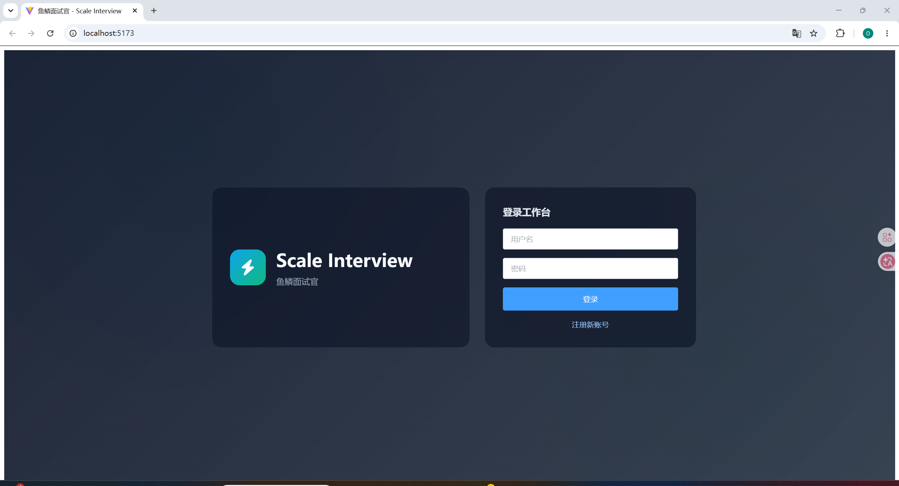
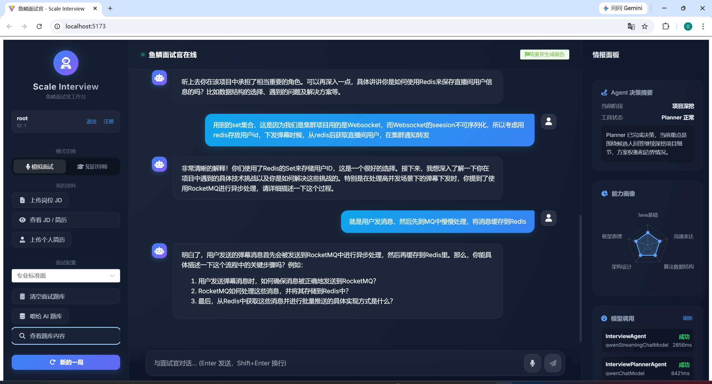
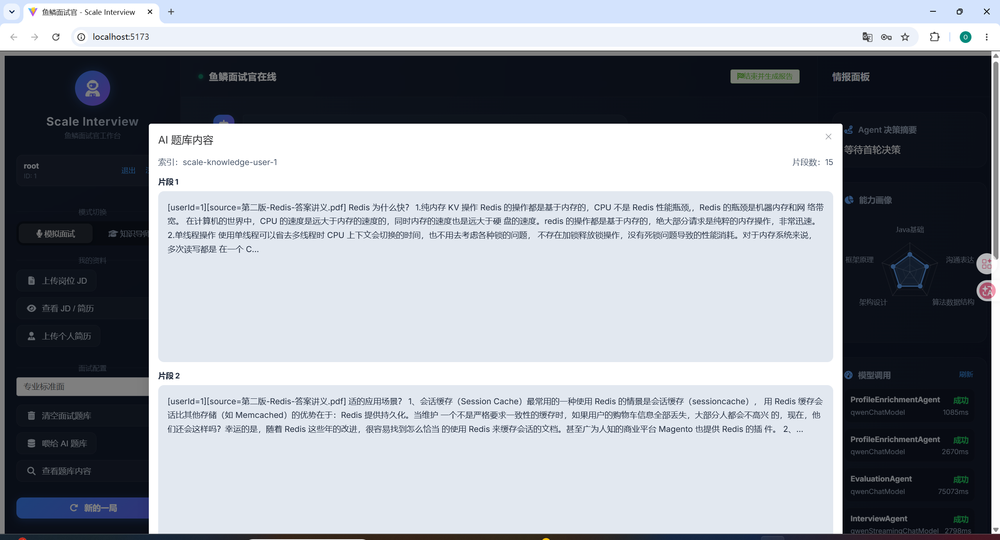
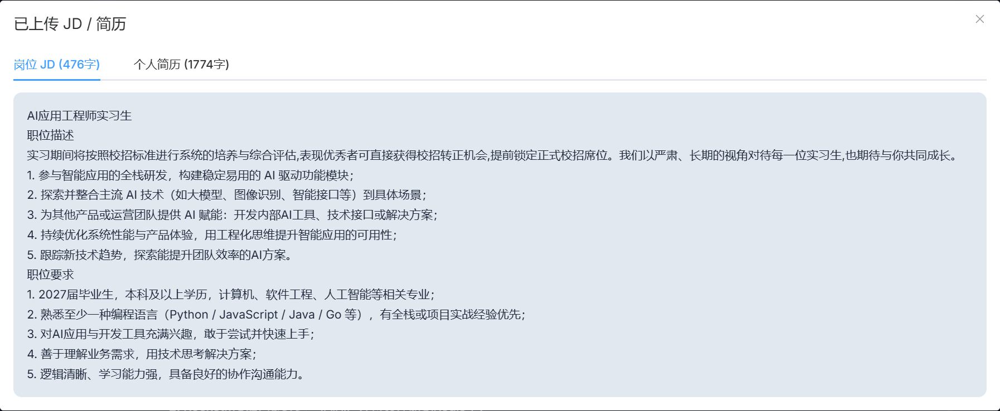
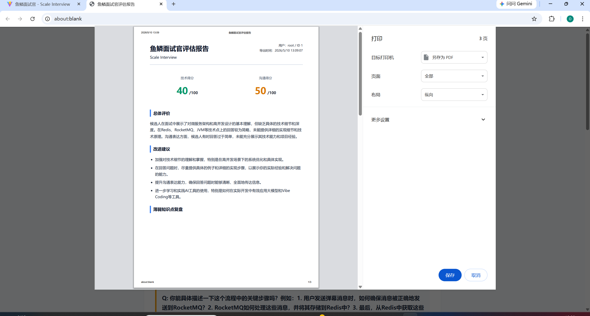
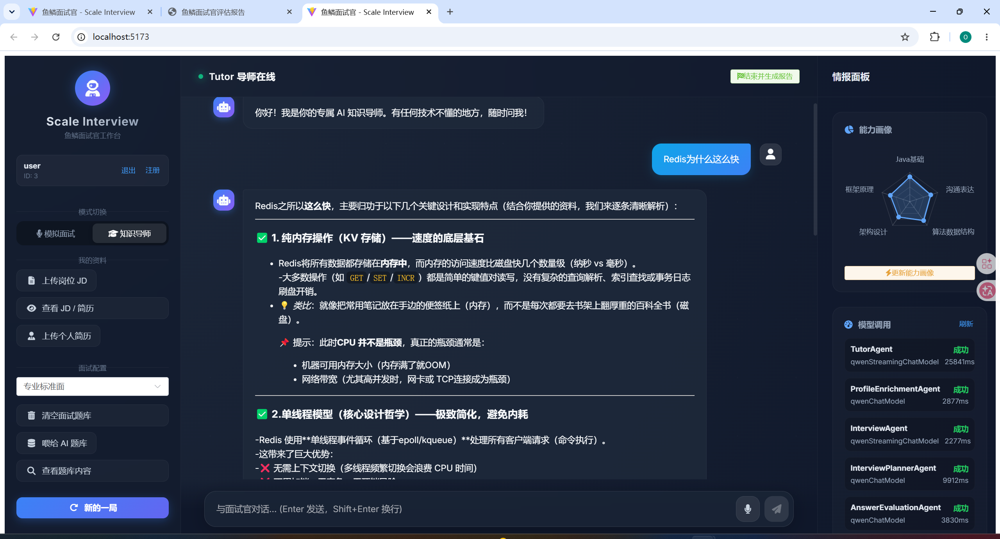

# Scale Interview

> 面向技术面试场景的多 Agent Workflow 系统  
> 基于简历与 JD 的模拟面试、Tutor 辅导、RAG 检索、逐轮评估与结构化报告


---

## 项目简介

Scale Interview 是一个面向求职面试场景的 AI 应用工程项目。它不是简单的聊天机器人，而是围绕“模拟技术面试”这个垂直场景，把状态机、Planner 决策、RAG 检索、逐轮评估、最终报告、可观测和兜底串成了一条完整的 Agent Workflow。

更准确的定位是：

> 面向垂直场景的可控 Agent Workflow 应用

---

## 项目截图

### 登录页


### 面试工作台


### 题库内容预览


---

### JD/简历内容预览



### 生成面试评估报告


### 面试评估报告pdf



### 辅导工作台



## 核心亮点

### 1. 多 Agent Workflow，而不是单一聊天模型

- `InterviewPlannerAgent`：负责下一步追问策略与阶段推进
- `InterviewAgent`：负责生成面试官流式回复
- `AnswerEvaluationAgent`：负责逐轮评分与薄弱点提取
- `EvaluationAgent`：负责最终结构化报告
- `TutorAgent / ProfileEnrichmentAgent`：负责辅导与画像更新

项目整体不是“完全自治 Agent”，而是 **Code Orchestrator + Specialized Agents** 的工程化方案。

### 2. 双层 Agent 结构，拆开决策与执行

- Planner 决策层输出 `ActionPlan`
- Interview 执行层按指令提问
- 服务端对 Planner 输出做对象级 structured output 校验、轻量重试和 fallback

这样做的目标是提升：

- 对话可控性
- 流程稳定性
- Trace 可追踪性

### 3. 面试状态机

系统显式维护面试阶段，而不是完全依赖模型自己记忆流程：

- `ICE_BREAKING`
- `BASIC_TECH`
- `DEEP_DIVE`
- `WRAP_UP`

并基于：

- 当前阶段
- 问题轮次
- Planner 决策结果
- fallback 规则

推进面试流程。

### 4. RAG 已做基础工程化补强

知识库链路不只是“上传文档 -> 检索”：

- 文本清洗
- 结构优先 chunking
- 长块二次切分
- overlap 保留
- query 规范化
- 候选 query
- fallback 检索
- `debug-search` 调试入口

### 5. 记忆不止窗口

当前记忆方案包括：

- 窗口式聊天记忆
- `sessionSummary` 结构化摘要记忆
- 显式状态记忆
- 逐轮评估与薄弱点画像沉淀

目标不是无限堆上下文，而是降低长对话中的注意力发散与 token 成本。

### 6. 可观测性与兜底

已补齐：

- Model Call Metrics
- Agent Trace
- Tool Trace
- Planner fallback 标签
- Report fallback
- RAG / Tool timeout degrade
- 日志脱敏

系统即使在：

- Planner 结果不合法
- 工具超时
- 报告模型失败

的情况下，也能继续完成主流程。

### 7. 用户级知识库隔离

知识库已按用户隔离，不再共享一个 ES 索引。  
当前采用的是：

> 按用户动态索引：`scale-knowledge-user-{userId}`

这样上传、清空、状态查看和检索都能按 `userId` 独立进行。

---

## 技术栈

### Backend

- Java 17
- Spring Boot 3.2.6
- LangChain4j 1.1.0
- MyBatis-Plus
- DashScope / OpenAI Compatible / Ollama
- MySQL / MongoDB / Elasticsearch

### Frontend

- Vue3
- Vite
- Element Plus
- ECharts

### Parsing / Retrieval

- Apache PDFBox
- Apache Tika
- Elasticsearch Embedding Store

---

## 仓库结构

```text
Scale-Interview/
├─ backend/      # Spring Boot + LangChain4j 后端
├─ frontend/     # Vue3 + Vite 前端工作台
├─ assets/       # README 展示截图
├─ .gitignore
└─ README.md
```

---

## 系统主链路

### 面试主链路

1. 前端发起 `/api/interview/chat`
2. 后端读取 `InterviewSessionState`
3. `InterviewPlannerAgent` 决策下一步
4. 需要时调用 `KnowledgeBaseTools`
5. `InterviewAgent` 流式生成面试官回复
6. `AnswerEvaluationAgent` 异步进行逐轮评估
7. 更新 `sessionSummary`
8. 保存 `InterviewAgentTrace`、模型指标与过程评估

### 最终报告链路

1. 读取该会话下的 `InterviewTurnEvaluation`
2. 汇总为 `evalSummary`
3. 调用 `EvaluationAgent` 生成最终报告
4. 失败时走规则版 `fallbackReport`

---

## 快速启动

### 环境准备

- JDK 17
- Maven
- Node.js
- MySQL
- MongoDB
- Elasticsearch
- 环境变量 `DASH_SCOPE_API_KEY`

### 数据库

默认数据库名：

```sql
CREATE DATABASE IF NOT EXISTS ace_interviewer CHARACTER SET utf8mb4 COLLATE utf8mb4_general_ci;
```

### 启动后端

```bash
cd backend
mvn spring-boot:run
```

### 启动前端

```bash
cd frontend
npm install
npm run dev
```

### 默认登录

```text
username: root
password: 1234
```

---

## 构建与测试

### 后端编译

```bash
cd backend
mvn -q -DskipTests compile
```

### 后端测试

```bash
cd backend
mvn test
```

### 前端构建

```bash
cd frontend
npm run build
```

---

## 项目边界

这个项目已经具备较完整的 AI 应用工程化骨架，但边界也很明确。

### 已落地

- 多 Agent Workflow
- RAG 基础优化
- 分层记忆
- 对象级 structured output
- Tool Trace
- 模型调用指标
- 用户隔离
- 规则兜底

### 未主打

- 完整 MCP 平台
- A2A 协议
- 企业级模型网关
- 高级检索算法平台
- 重型多模型编排框架

所以它更适合展示：

- Agent Workflow 工程化
- AI 应用后端落地
- RAG / 记忆 / 可观测性基础实践

---

## 面试时推荐怎么讲

推荐说法：

> 我做的是一个面向技术面试场景的多 Agent Workflow 系统。系统通过状态机管理面试阶段，通过 Planner 决策下一步问题，通过 Tool 调用接入知识库，通过逐轮评估沉淀过程数据，最终生成结构化报告，并且补齐了用户隔离、RAG 调试、摘要记忆、模型指标和兜底逻辑。

不建议夸大的说法：

- 完整 MCP 平台
- 完整 A2A 协议实践
- 企业级模型网关
- 高级检索算法平台
